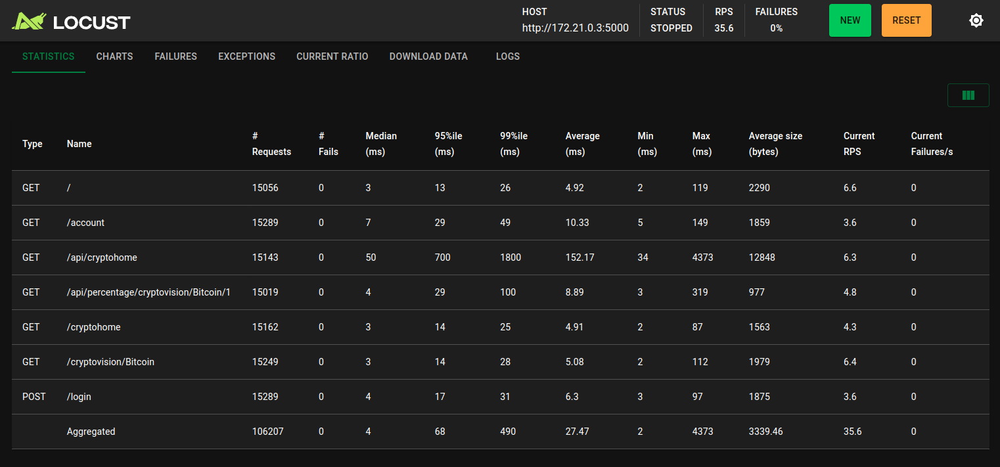
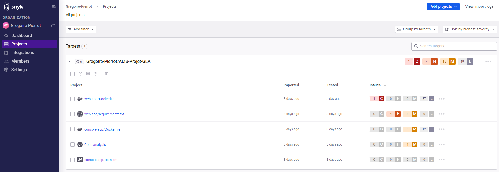

# Rapport de projet

---

## Introduction

### Contexte et objectifs

**Le projet** consiste à développer une application qui collecte périodiquement des données sur les marchés des cryptomonnaies à partir d'APIs publiques (CoinCap ou autre) et à les exploité sur un site web. Il y a donc eu deux applications distinctes à développer.

**La première est une application en console** qui tournera en permanence, collectant périodiquement des données sur les marchés des cryptomonnaies à partir d’APIs publiques. Elle recueillera les informations pertinentes, tels que les prix, les volumes d'échange et d'autres indicateurs clés, et stockera ces données sur une base de données. 

**La seconde est une application web** sur laquelle les utilisateurs pourront se connecter afin de visualiser ces données sous forme de graphiques interactifs et offrira une interface intuitive permettant de naviguer entre différentes cryptomonnaies, de sélectionner des plages de temps spécifiques et d'afficher divers types de graphiques tels que la courbes de prix ou la courbe de pourcentage de changement en 24 heures.
L'application permettra en outre de configurer des alertes personnalisées. Les utilisateurs pourront définir des seuils de prix, des variations de pourcentage ou des indicateurs techniques spécifiques pour être notifiés lorsque ces conditions sont remplies. Les notifications pourront être reçues via des emails.
Enfin, l'application proposera des prévisions basées sur des algorithmes simples tels que des moyennes mobiles (moyennes glissantes), des régressions linéaires ou autres. Ces prévisions aideront les utilisateurs à anticiper les tendances du marché, tout en étant informés des limites et des marges d'erreur associées à ces modèles.

## Méthodologie de développement

### Méthodologie de développement

#### - Méthodes Agile et Scrum -
Pour structurer et organiser le développement de l’application, la méthodologie Scrum a été adoptée. Cette approche itérative et incrémentale a permis de diviser le projet en sprints distincts, facilitant ainsi la priorisation des tâches, l'adaptation aux imprévus et l'évaluation continue de l’avancement.
En l’absence d’une équipe complète, j’ai assumé plusieurs rôles, notamment ceux de Product Owner, Scrum Master et développeur.

Les sprints ont été planifiés sur une durée fixe, chacun avec des objectifs clairs :

- **Sprint 1** : Mise en place des bases du projet.
- **Sprint 2** : Préparation et collecte des informations nécessaires depuis l'API.
- **Sprint 3** : Développement et tests de la Console-App.
- **Sprint 4** : Développement de la Web-App et réalisation des tests.

#### - Organisation des sprints -

**Sprint 1 : Mise en place des bases du projet**
Durant ce sprint, l’objectif était de poser les fondations du projet pour assurer une bonne structure dès le départ.

- Création du dépôt GitHub pour héberger et versionner le code des deux applications.
- Élaboration du backlog produit, listant les fonctionnalités principales à implémenter pour répondre aux besoins identifiés.
- Prévision de l’arborescence des fichiers pour chaque application afin de structurer le projet de manière cohérente et maintenable.

**Sprint 2 : Analyse des données API**
Ce sprint s’est concentré sur l’identification et la sélection des informations pertinentes à extraire depuis l’API.

- Étude approfondie de l’API publique sélectionnée.
- Définition des données nécessaires, comme les prix, les variations en pourcentage, et les volumes d’échange des cryptomonnaies.
- Préparation d’une structure pour stocker ces données dans la base de données.

**Sprint 3 : Développement et tests de la Console-App**
Le travail de ce sprint portait sur le développement de l’application console pour récupérer et stocker les données.

- Conception et développement de la Console-App en Java :
- Connexion à l’API publique.
- Extraction des données nécessaires.
- Enregistrement des données dans une base de données relationnelle (SQLite).
- Réalisation des tests unitaires à l’aide de JUnit pour garantir la fiabilité des méthodes critiques, comme la récupération des données et leur insertion en base de données.

**Sprint 4 : Développement et tests de la Web-App**
Le dernier sprint s’est concentré sur le développement de la Web-App et la réalisation des tests finaux.

- Conception et développement de la Web-App avec Flask :
- Création de l’interface utilisateur pour la connexion, la visualisation des données, et la configuration d’alertes.
- Intégration de graphiques interactifs pour présenter les données de manière claire.
- Réalisation des tests de sécurité :
- Vérification des mécanismes de protection des données utilisateur (mot de passe, sessions).
- Tests de vulnérabilités potentielles, comme les injections SQL.
- Réalisation des tests de performance à l’aide de Locust :
- Simulation de charges pour évaluer la capacité du site à répondre à un grand nombre de requêtes simultanées.

## Développement technique

Voir la [documentation](Documentation.md).

## Les tests

La qualité du projet a été évaluée à l'aide de différents types de tests : unitaires, de performance et de sécurité. Bien que tous n’aient pas pu être finalisés, ces tests offrent une bonne base pour garantir la fiabilité, la robustesse et la sécurité des applications.

### Tests unitaires
Les tests unitaires ont été réalisés pour vérifier la validité des différentes méthodes implémentées dans la Console-App.

- **Outils utilisés** : JUnit et Mockito.
- **Approche** :
  - Les tests unitaires couvrent l’intégralité des fonctionnalités principales, notamment la connexion à l’API, l’extraction des données et leur insertion en base de données.
  - L’utilisation de mocks avec Mockito a permis de simuler certains comportements externes, comme les réponses de l’API, pour tester les méthodes de manière isolée.
- **Limites** :
  - Toutes les méthodes n'ont pas pu être testées par manque de temps.
  - Certains tests nécessitent encore des ajustements ou des validations pour être pleinement opérationnels.

### Tests de performance
Les tests de performance ont été effectués pour évaluer la capacité de la Web-App à supporter une charge utilisateur importante.

- **Outil utilisé** : Locust.
- **Scénario testé** :
  - Simulation de 100 utilisateurs effectuant simultanément des requêtes sur le site.
  - Les utilisateurs exécutent des actions comme la visualisation des données ou la configuration d’alertes.
- **Résultats** :
  - Les résultats, présentés sous forme de captures d’écran (voir annexes), montrent les temps de réponse moyens, les éventuelles erreurs, et les capacités de l’application à gérer la charge.
  - Une légère dégradation des performances au niveau de la partie de l'affichage global des cryptomonnaies a été observée sous forte charge, indiquant un axes d’optimisation.

### Tests de sécurité
Pour s’assurer de la sécurité des applications, une analyse automatique des vulnérabilités a été réalisée.

- **Outil utilisé** : Snyk.
- **Approche** :
  - Analyse du code source pour identifier les dépendances ou pratiques potentiellement vulnérables.
  - Les résultats de l’analyse sont présentés sous forme de captures d’écran (voir annexes).
- **Résultats** :
  - Les vulnérabilités Dockerfile viennent des images python et maven. Quelque soit leur version, les vulnérabilités restent les même.
  - Les vunérabilités des librairies python viennent du framwork flask et qui comportent les même vulnérabilités pour toutes ses versions.
  - Le code lui présente une vunérabilité dans une page du site avec du javascript. A cette endroit l'utilisateur peut rentré une chaine de caractère qui sera affiché dans la page.

## Gestion des outils et intégration continue

### Utilisation de Docker
Docker a été utilisé pour isoler les environnements des applications et simplifier leur déploiement. Chaque application a été empaquetée dans son propre conteneur, garantissant une exécution indépendante des dépendances et des configurations locales.

- **Approche utilisée** :
  - Un script [start.sh](start.sh) a été créé pour automatiser la construction et le lancement des conteneurs avec docker compose.

- **Avantages de Docker** :
  - Garantit la portabilité des applications entre différents environnements.
  - Réduit les problèmes de configuration liés aux dépendances.
  - Facilite le partage et la collaboration via des images Docker

### Analyse d’un fichier Docker Compose
Le fichier [docker-compose](docker-compose.yml) a permis de définir et gérer facilement les services nécessaires au projet.

- **Description des services** :
  - console-app : Gère la récupération et le stockage des données.
  - flask : Fournit l'interface utilisateur et l’accès aux données stockées.
  - nginx : Sert de serveur proxy pour améliorer les performances et gérer les requêtes entrantes.

- **Fonctionnalités principales** :
  - Les volumes partagés, comme shared-db, permettent de stocker des données de manière persistante et de les partager entre les conteneurs.
  - Le réseau app-network garantit que les services peuvent communiquer entre eux de manière isolée.
  - Le service nginx configure un proxy inverse avec des ports spécifiques pour HTTP et HTTPS.

- **Avantages de Docker Compose** :
  - Simplifie la gestion multi-conteneurs grâce à un seul fichier de configuration.
  - Facilite le déploiement des services sur différents environnements avec une commande unique.

### Intégration continue et DevOps

#### GitHub Actions
Pour garantir une livraison continue et la qualité du code, GitHub Actions a été utilisé pour automatiser certaines tâches :

- **Automatisation des tests** :
  - Tests unitaires sur la Console-App pour valider les fonctionnalités après chaque modification du code.
  - Tests de déploiement des conteneurs pour vérifier leur bon fonctionnement.

- **Génération de la documentation** :
  - Production de la Javadoc à partir du code Java.
  - Déploiement automatique de la documentation sur GitHub Pages pour un accès public.

- **Gestion de la couverture du code** :
  - Codecov a été intégré pour mesurer et surveiller la couverture des tests unitaires.
  - Le choix de Codecov s’est imposé en raison de l’incompatibilité avec la version locale de SonarQube.
  - Codecov a permis d’obtenir des rapports détaillés sur la couverture du code, aidant à identifier les parties non testées du projet grâce à l'utilisation de `Jacoco`.

---

## Bilan
### Retour sur la méthodologie Agile et l’organisation des sprints
L’utilisation de la méthodologie Scrum a permis de structurer le projet en sprints successifs, chacun visant des objectifs clairs et atteignables. Cependant, bien que cette approche ait facilité la priorisation des tâches et assuré une progression régulière, certains ajustements auraient pu être réalisés pour maximiser l’efficacité :

- **Points positifs** :
  - Une organisation claire dès le départ, avec la mise en place du backlog et la structuration des applications.
  - Une progression itérative qui a permis de livrer des fonctionnalités clés, notamment la récupération des données via l’API et leur affichage sur la Web-App.
- **Points à améliorer** :
  - Un nombre limité de sprints (quatre) n’a pas permis de couvrir toutes les fonctionnalités prévues initialement.
  - Une planification plus fine aurait pu intégrer des sprints supplémentaires dédiés aux fonctionnalités manquantes, telles que la prédiction des prix des cryptomonnaies et les alertes liées aux seuils de prix.

### Tests réalisés et limites
Les tests ont constitué une étape clé pour garantir la qualité des applications, bien que certains soient restés incomplets.

- **Tests réalisés** :
  - Tests unitaires avec une couverture importante des méthodes critiques de la Console-App.
  - Tests de performance réalisés via Locust, validant la capacité de la Web-App à supporter jusqu’à 100 utilisateurs simultanés.
  - Tests de sécurité avec Snyk, permettant de détecter des vulnérabilités mineures dans les dépendances.
- **Limites des tests** :
  - Les tests unitaires n’ont pas couvert tous les fichiers du projet, et certains nécessitent encore des ajustements.
  - L’absence de tests d’intégration a limité la validation de l’interaction entre les différents modules.
  - Aucun test approfondi n’a été réalisé sur le serveur en dehors des tests de performance et de sécurité.

### Fonctionnalités manquantes
Malgré l’accomplissement des principales fonctionnalités, certaines n’ont pas pu être développées dans les délais impartis :

- **Prédiction des prix des cryptomonnaies** : Bien que planifiée, cette fonctionnalité nécessitait un travail supplémentaire sur les algorithmes de prévision, ainsi que sur l’intégration avec l’interface utilisateur.
- **Alertes sur les seuils de prix** : Cette fonctionnalité, bien qu’identifiée comme essentielle dans les premières étapes du projet, n’a pas pu être implémentée.

### Leçons apprises et pistes d’amélioration
- **Amélioration de la planification des sprints** :
  - Ajouter des sprints dédiés aux fonctionnalités avancées et aux tests aurait permis de mieux gérer le temps et les priorités.
  - Une évaluation plus fréquente de la progression aurait pu identifier les retards plus tôt.
- **Optimisation des tests** :
  - Intégrer des tests d’intégration et améliorer la couverture des tests unitaires dès les premiers sprints.
  - Réserver un sprint dédié aux tests sur le serveur pour valider son fonctionnement dans des conditions réelles.
- **Priorisation des fonctionnalités** :
  - Se concentrer d’abord sur les fonctionnalités indispensables, comme les alertes de prix, aurait permis de livrer un produit plus complet.

## Conclusion
Le projet a permis de développer un prototype fonctionnel avec des bases solides, intégrant des outils modernes comme Docker, GitHub Actions et Codecov pour assurer la qualité et la portabilité des applications. Cependant, des limitations, principalement dues à des contraintes de temps et d’organisation, ont empêché l’achèvement de toutes les fonctionnalités prévues. Ces expériences serviront de leçon pour améliorer les futurs projets, notamment en matière de planification et d’exécution des tests.

---

## Annexes

### Locust :

### Snyk :

